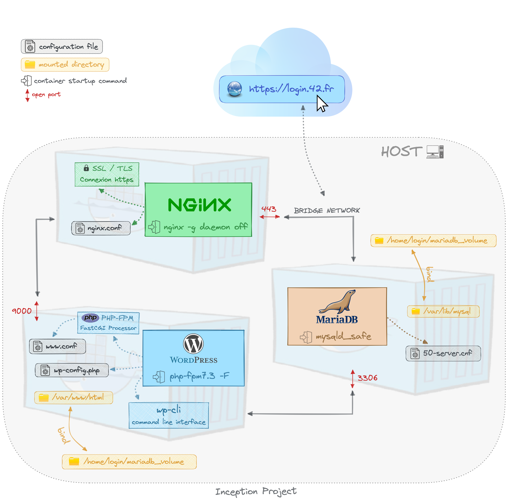

<h1 align="center">
        Inception
</h1>

	<b><i>42 CURSUS INCEPTION PROJECT</i></b> 

## 💡 About the project

This project is about containers, consist in create 3 containers with **Docker Compose**, creating the 3 images with the **Dockerfile**.
This project use a specific network, and 2 volumes, for the DataBase and for the Wordpress Site.

The network diagram is the next:

  

## Containers
This project has the next containers:
### MariaDB
A Debian container, with mariadb installed and automatically configured via a .sh script
### Wordpress
A Debian container, with php php, wordpres, and wordpres-cli installed. PHP is used for deploy the wordpress site, and with the worpres-cli is configurated the site automatically.
### Nginx
A debian container, with ngingx for deploy the site and use the SSL certicates.

## Network
Only use a network, the MariaDB and Wordpress containers expose two ports, and the Nginx container fordward the port 443 to the host.

## Volumes
This has two volumes:
### DataBase
In this volume is saved all information about the MariaDB DataBase. Is used only by the MariaDB container.
### Wordpress
This volume is used by the Wordpress container and by the Nginx container for deploy the site.
